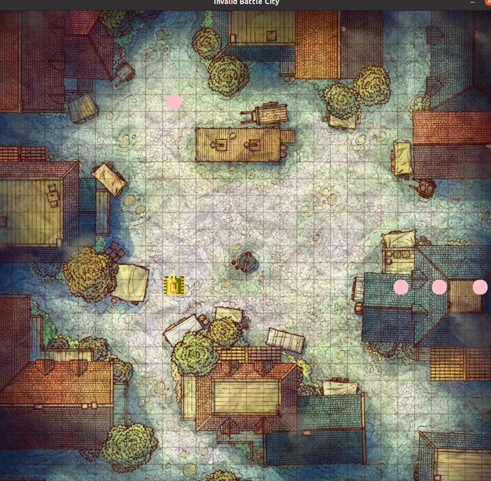

# Лабораторная работа №1

### Первая часть

Задание: "создать программу, которая выводила бы анимацию движения робота телеги по синусоиде. Траекторию также необходимо нарисовать. Фон для данной анимации необходимо загрузить из какого-либо файла. Когда робот будет на середине экрана, то необходимо сохранить изображение в файл встроенными средствами OpenCV."

Реализация данной части расположена в файлах src/telega.hpp и src/telega.cpp:

- Класс Telega инициализируется путями к файлам изображений фона и модели робота

- В конструкторе инициализируются объекты класса cv::Mat, соответствующие фону и модели робота при помощи функции cv::imread()

- Модель робота позиционируется на карте по центру изображения модели. Положение центра модели робота - позиция робота на фоне

- Основной пайплайн движения прописан в методе run. Через него задается начальная позиция робота (столбец, тк строчка всегда задается 0-ая), амплитуда синусоиды и период синусоиды

- Для хранения пройденной траектории создается объект класса cv::Mat::zeros - нулевая матрица размера исходного изображения фона

- Метод telegaSinus выполняет перемещение изображения модели робота по синусоиде, а также обновляет объект с пройденной траекторией. Проводится cv::line между предыдущей точкой и текущей

- При помощи метода drawOnBackground модель робота и траектория рисуется на копии изображения фона (созданной при помощи метода background.clone()). Находится положение левого верхнего угла накладываемого изображения и попиксельно копируется в клона фона

- Когда модель робота проходит пол пути (background.rows / 2), то сохраняется текущее изображение при помощи метода cv::imwrite()

### Вторая часть

Задание: "Создать игру "танчики", в которой загружаемый из файла танк (картинка) двигалась бы по нажатию клавиш с клавиатуры и могла бы выпускать условный снаряд"

Реализация данной части расположена в файлах src/tank.hpp и src/tank.cpp:

- Для объектов снарядов создан класс Ball. Для остальных элементов игры создан класс Tank

- Класс Tank инициализируется картинкой карты, картинкой танка, картнкой снаряда, скоростью танка и скоростью снаряда. Последние 3 могут быть упущены, тк имеют стандартные значения. В том числе модель снаряда стандартно заменяется cv::circle размером 15х15

- Модели танка и снаряда изменяют размеры под играбельные при помощи cv::resize

- Для моделей танка и снаряда при помощи cv::rotate создается по 3 копии в соответствии с возможными ориентациями направления движения 

- Модели снарядов и танка позиционируются на карте по левому верхнему углу. Верхний левый угол модели снаряда/танка - позиция снаряда/танка

- Основной пайплайн игры прописан в методе run

- Изначально танк устанавливается посередине поля

- cv::waitKey(20) в течении 20мс ждет значения клавиши. Полученное значение обрабатывается, откуда делается вывод об необходимости передвинуть модель танка влево/вправо/вверх/вниз, заспавнить объект снаряда (добавить еще один элемент в вектор) или закрыть приложение

- В методе outOfMap проверяется выход за пределы карты. В случае выхода снаряда за пределы карты - снаряд уничтожается. В случае выхода за пределы карты танка - делается возврат к предыдущему положению

- Метод renderFrame рисует на map.clone() модель танка в его текущем положении, а также все элементы вектора со снарядами

