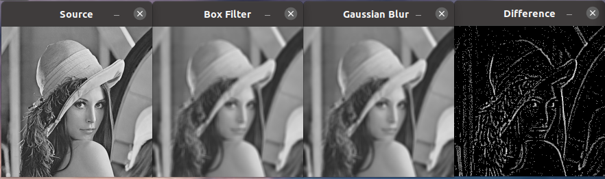
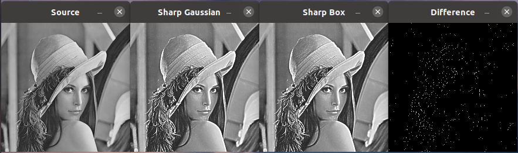

# Лабораторная работа №2

### Задание: 
1. Создать отдельную функцию, которая бы сглаживала одноканальное изображение при помощи фильтра по среднему значению пикселей внутри ядра размером 3х3 (в лекциях обозначен как box filter). Для этого рекомендуется использовать ОИ. Функция вычисления, однако, должна иметь возможность менять размер окна.
2. Проверить правильную работу созданной функции при помощи функции из OpenCV void blur(InputArray src, OutputArray dst, Size ksize). Для этого необходимо программно сравнить изображения, проверяя равенство каждого пикселя одного изображения другому пикселю. Для этого рекомендуется использовать способ The Core Function из ранее приведённой ссылки. Вывести значение их схожести в виде процентов. Если схожесть 98%-100%, то твоя функция работает исправно. Отличие в немного % может объясняться тем, что вы не обработали рамку по краям изображения. Иногда эту рамку оставляют (как в нашем простом случае), иногда обрабатывают, достраивая дополнительные пиксели или беря их с других участков изображения. Необходимо вывести оба изображения.
3. Измерить время работы каждой функции и вывести его в консоль. Вывести результат измерений.
4. Отфильтровать изображение функцией Гаусса и сравнить результат с box filter. Субъективно оценить качество изображения. Вывести оба изображения и сравнить их путем наложения и вывода разности двух фильтраций. Улучшить отображение выведенной разницы применив логарифмическое преобразование изображений.
5. Реализовать unsharp mask с фильтром Гаусса и Box фильтром. Оба фильтра необходимо применить с одинаковым коэффициентом резкости. Сравнить оба изображения путем наложения и вывода разностного изображения.
6. Реализовать фильтр Лапласа (руками, свой). Вывести результат.
7. Реализовать unsharp mask с фильтром Лапласа. Вывести результат и сравнить с п.5.

### Задание 1-3

На рисунке ниже показано исходное изображение, обработка фильтром среднего с написанным вручную и фильтром встроенным в opencv, а также разница между полученными изображениями

Результаты измерения скорости выполнения двух методов показывают превосходство встроенного примерно в 1000 раз. Процент схожести изображений зависит от выбранного размера ядра фильтра, тк от него зависит размер необработанного края.

### Задание 4

На риснуке ниже показано исходное изображение, изображения, обработанные фильтром среднего и фильтром гаусса, а также разница между отфильтрованными изображениями, обработанная логарифмичским преобразованием для улучшения восприятия "на глаз". Из рисунка видно, что фильтр гаусса дает более плавную картику, а также меньше размывает границы, что может быть связано с "кргулой" формой ядра.

### Задание 5

В данном случае мой глаз не сильно видит разницу между unsharp mask с фильтром Гаусса и Box фильтром, впрочем как и при вычитании изображений - разница становится заметна только после применения логарифмического преобразования. Но границы после unsharp mask с фильтром гаусса все же, наверное, выглядят более четкими.

### Задание 6-7

Фильтр Лапласа, в отличие от промежуточного результата в unsharp mask с Box фильтром и фильтром Гаусса, находит больше границ, что видно из рисунка ниже

Логика повышения резкости данными методами различается. С фильтром Лапласа - границы вычитаются из исходного изображения. С unsharp mask - границы складываются с исходным изображением. Таким образом получается несколько иной характер картинки. Лаплас - более темный. Unsharp mask - более светлый

