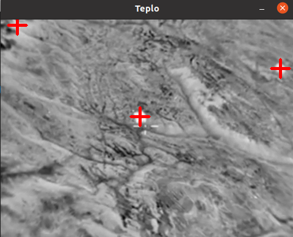
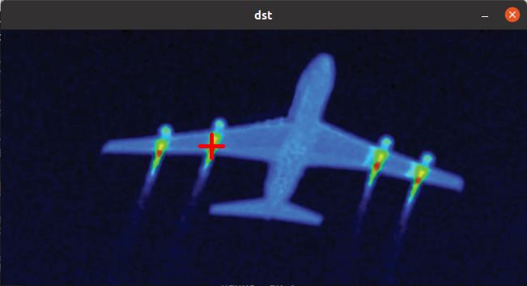
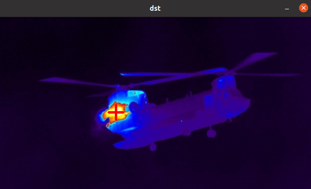
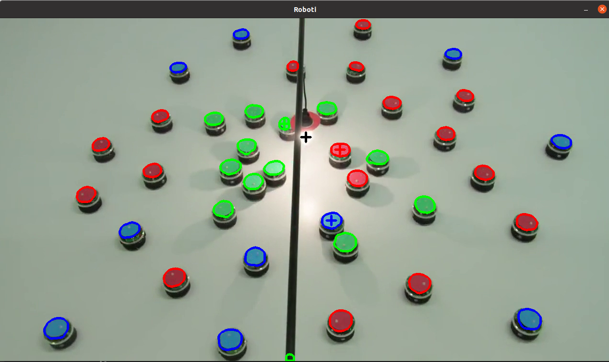
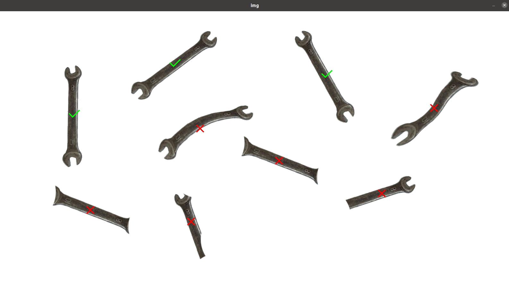

# Лабораторная работа №3

### Задание:
1. «Товарищ!!! Помоги пилоту бомбардировщика найти демократически умеренных жителей с автоматами при помощи тепловизора. Известно, что они любят прятаться в уютных тёплых домиках (которые заметно теплее всего остального) и там же делать свои тёмные делишки. Чтобы пилоту было удобнее навестись тебе надо обозначить примерный центр цели на изображении». См. картинки в папке «allababah».
2. «Товарищ! Родина не ждёт! Тебя отправили работать в сверхсекретное КБ, где тебе поручили разработать сверхсекретную систему сверхсекретного наведения на забугорные транспортные средства, которые желают принести нам демократию. Твоя задача - точно навести сверхсекретную пушку на тёпленькое моторное отделение». См. картинки в папке «teplovizor».
3. «В том же секретном КБ тебе поручили следить за особыми экспериментальными роботами, которые любят погреться под лампочкой. Твоя задача:
    1) На каждом роботе найти его цветную верхнюю крышку и обвести контуром цвета его команды;
    2) Найти лампу, обозначить её как-нибудь.
    3) Для каждой команды обозначить ближайшего робота к лампе, путём рисования его центра масс.»
См. картинки в папке «roboti».
4. А теперь тебе поручили разработать систему ТЗ по отбраковке гаечных ключей для сборки тех роботов. Обозначь бракованные и правильные гаечные ключи разными метками. См. картинки в папке «gk».

### Задание 1

Так как по заданию программа пишется для человека - есть смысл выделять несколько объектов сразу. Поэтому сделана возможность одновременного отслеживания 3х точек интереса, которые являются самыми большими на изображении - а значит, скорее всего наиболее достижимыми.

### Задание 2

В случае с автонаведением логично иметь только одну цель. Тут выбирается самая большая в заданном диапазоне цвета

### Задание 3

На изображении ищется местоположение самого яркого пятна - лампочки. Для поиска роботов исходное изображение фильтруется по цвету (hue) и по насыщенности (saturation). На найденных масках находятся контуры, которые сравниваются с шаблоном, имеющим форму крышки робота - круг. Оставшиеся контуры - контуры, принадлежащие одному классу (цвету роботов). Среди них выбирается наиболее близкий к местоположению лампочки и отмечается.
Проблемы в данной реализации:
    - красный обод вокруг лампочки периодически выделяется как робот
    - При некоторых углах освещения зеленые роботы могут иметь оттенок, схожий с фоном и теряться на изображении

### Задание 4

Находится конутр шаблона, контуры на изображении. Далее по коэффициенту схожести выбирается, правильный инструмент выделен контуром или нет.

