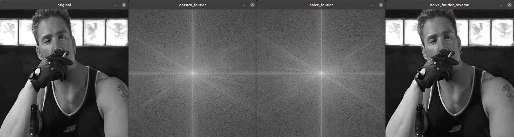
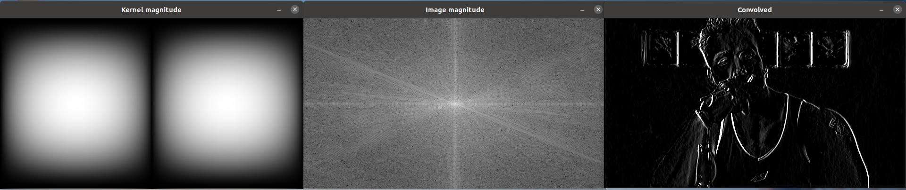
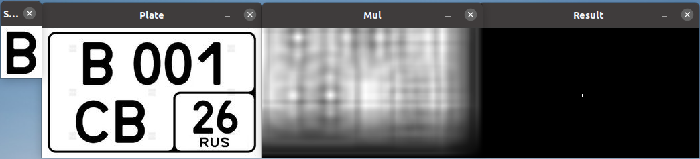
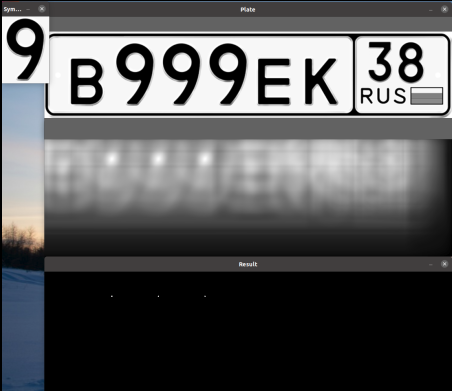

# Лабораторная работа №4

### Задание 1

*Написать свою функцию преобразования Фурье (прямое и обратное) используя «лобовой подход».*

Для ускорения математических расчетов с комплексными числами было решено использовать в матрицах тип `cv::Complex<float>`. Для упрощения дальнейших сравнений свои функции сделаны такими, чтобы они они принимали на вход те же самые входные данные, что и функция, встроенная в opencv. Встроенная функция `cv::dft` в opencv принимает на вход данные в виде cv::Mat с типом данных у элементов типа CV_32FC2, т.е. двухканальныее изображения. Один канал - вещественная часть, второй - мнимая. Для перехода от двухканальных изображений к `cv::Complex<float>` и наоборот были написаны функции convertToComplex и convertFromComplex, также используемые в задании 2.

Реализация лобового метода основана на построении двух матриц комплексных экспонент, размеров `строки х строки` (R) и `столбцы х столбцы` (C). Преобразование (F) выполняется путем последовательного перемножения полученных матриц на изображение (I): `F = R * I * C`.

Обратное преобразование выполняется той же самой функцией, но с изменением знака мнимой части при инициализации первого элемента матрицы комплексных экспонент.

На рисунке ниже слева направо: исходное изображение, перобразование функцией opencv, прямое преобразование лобовым методом, обратное преобразование. В случае обратного преобразования баланс цвета немного уплыл по причине использования для вывода изображения вычисления магнитуды в логарифмической шкале

### Задание 2

*Написать преобразование Фурье используя алгоритм Radix-2 (по основанию 2, или «Бабочка»)*

Полученная функция также использует вспомогательные функции convertToComplex и convertFromComplex из первого задания. Также особенностью реализации является разложение двумерного массива (т.е. изображения) в одномерный (т.е. в линию). Алгоритм cooley-turkey применяется уже к одномерному массиву, а затем выполняется обратный переход в двумерный. На рисунке слева направо: исходное изображение, перобразование функцией opencv, преобразование с использованием алгоритма radix-2

Странно, но выполнение двоичной инверсии для порядка элементов массива привело к тому, что алгоритм перестал работать - на нем появилась нежелательная сетка.

### Задание 3,4

*Сравнить быстродействие из функций из первой и второй части, а также с преобразованием из OpenCV*

Время выполнения функций сравнивалось при помощи std::chrono, поочередно скармливая одну и ту же картинку разным функциям. По результатам сравнения самым быстрым оказался встроенный алгоритм, примерно в ~200 раз быстрее. Такая большая разница может быть объяснена лишними переводами типов данных, а таже сильной неоптимизированности кода. А преимущество в скорости выполнения у cooley-turkey перед лобовым методом оказалось на уровне 20%. 

Кроме того, также были сравнены совпадения полученных спектров (если разница в значении не превышает одного процента - совпадают). Результат лобового метода максимально совпадает с результатом полученным с помощью функции opencv, а результат cooley-turkey находится на уровне 70-80%. Эти различия могут быть обусловлены использованием разложения изображения в одномерный массив при использовании рекурсивного метода.

### Задание 5,6,7

- *Операции свёртки и корреляции выполнять можно только при помощи преобразований Фурье.*

- *Работаем с одноканальным изображением (желающие могут и с цветным, на свой страх и риск).*

- *Произвести по отдельности свёртку какого-либо изображения с ядром фильтров: Собеля (по горизонтали и вертикали), усредняющего (BoxFilter), Лапласа. Необходимо «красиво» вывести магнитуду образа Фурье исходного изображения и ядра свёртки. Полученные образы Фурье в результате выполнения свёртки следует обратно преобразовать в изображение. Сначала обрезаем полученное изображение (при помощи ROI) до первоначального размера. Полученное изображение нормализуем (с теми же параметрами, как и в примере, приведённом в теории) и выводим.*

Собственно, все выполнено по заданию. Свертка выполнялась с образами фурье ядра и изображения функцией `cv::mulSpectrums`. Результат на картинках ниже. По порядку: Box filter, фильтр Лапласа, фильтр Собеля по горизонтали, фильтр Собеля по вертикали

### Задание 8

*Взять какое-нибудь изображение и в его спектре обрезать в одном случае элементы спектра с высокими частотами, в другом – низкими. А потом выполнить обратное преобразование на основе полученных спектров:*

Для обрезания низких частот использован cv::circle с задаваемым радиусом, располагаемый в центре изображения. Обрезание верхних частот происходит путем применения исключающего или к исходному спектру и спектру с обрезанными нижними частотами.

### Задание 9

*Провести корреляцию (сравнение) изображений автомобильных номеров по очереди с 3-мя символами. Полученный образ Фурье обратно преобразовать в обычное изображение. Найти на нём наибольшее значение, которое принимают элементы. Отнять от этого значения небольшое число (около 0.01). Использовать полученное число в качестве порога для пороговой фильтрации от полученного изображения*

Все сделал по заданию, картинки похожи на задание)

