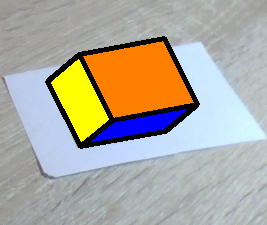

# Лабораторная работа №5

### Задание:
1. Откалибровать собственную камеру при помощи доски aruco.
2. Откалибровать с помощью Calibration Toolbox (Matlab)
3. Сгенерировать маркер Aruco из понравившегося словаря
4. Написать программу, которая бы детектировала маркер на изображении и рисовать куб с основанием в виде маркера (куб должен быть спроецирован на плоскость изображения и иметь различные цвета ребер). Используйте захват видеопотока с камеры (VideoCapture), чтобы получать изображения.

### Задание 1

Для калибровки камеры были взяты файлы `create_board.cpp` и `calibrate_camera.cpp` из директории `usr/local/share/opencv4/samples/aruco`. В них были заданы свои параметры. Исправленные файлы лежат в `calibration_utilities`. По ним была произвелена калибровка. Полученные файлы конфигурации .yml и .xml лежат в `config`. Вместе с ними лежит файл из методы с параметрами детекции в формате .yml.

### Задание 2

Матлаб отсутствует
... сяду на коня, и ускачу куда-то в #беня...

### Задание 3

Файл для генерации маркера aruco лежит в `calibration_utilites`, называется `create_tag.cpp`

### Задание 4

Для выполнения задания была написана программа, которая выполняет поиск маркеров aruco на изображениях, получаемых с вебки ноутбука. Изначально словарь для поиска маркеров задается нулевым указателем. Пока этот указатель нулевой, ничего не ищется. Для начала поиска нужно поместить в область видимости камеры маркер Aruco и нажать кнопку 'e'. Программа автоматически определит, какой словарь ей следует использовать, основываясь на количестве распознанных маркеров каждого словаря. Для смены словаря также следует дать "покушать" камере маркер из интересующего словаря и нажать 'e'.

Сами маркеры определяются при помощи встроенных средств opencv, а именно функции cv::aruco::detectMarkers. Для найденных маркеров при помощи функции cv::aruco::estimatePoseSingleMarkers находтся вектора поворота и перемещения для перехода от системы координат маркеров к системе координат изображения.

Первоначально куб со стороной равной длине стороны маркера инициализируется в системе координат маркера. Затем по найденным ранее векторам при помощи функции projectPoints находятся проекции куба на 2D изображение камеры.

Для предотвращения наложения сторон куба в неправильном порядке необходимо знать, какие стороны куба наиболее удалены от начала системы координат камеры, а какие наименее удалены. То есть, в соответствии с документацией https://docs.opencv.org/4.x/d9/d0c/group__calib3d.html#ga61585db663d9da06b68e70cfbf6a1eac, нам интересно положение точек куба в системе координат камеры по оси z. Его можно найти при помощи перехода в однородные координаты и поиска положения точек путем домножения на матрицу 4х4, которую можно получить из векторов поворота и перемещения. Все эти преобразования реализованы в функции `drawCubes` в файле `src/cube_utility.cpp`.

Далее для центра каждой стороны находится положение по оси z системы координат камеры. Затем в порядке убывания этого значения рисуются проекции сторон куба на захваченный с камеры кадр. Реализция данной сортировки реализована в функции `drawCube` в файле `src/cube_utility.cpp`.

Поверхности куба могут быть заданы как непрозрачными, так и прозрачными.

